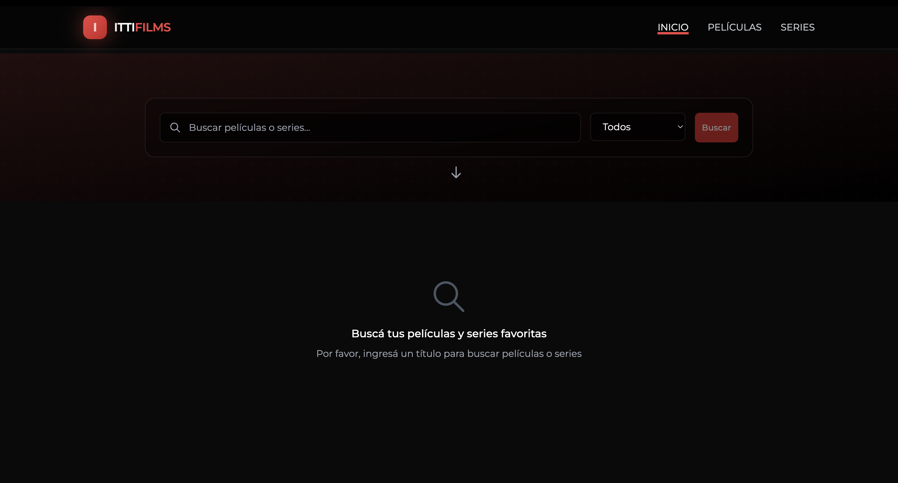
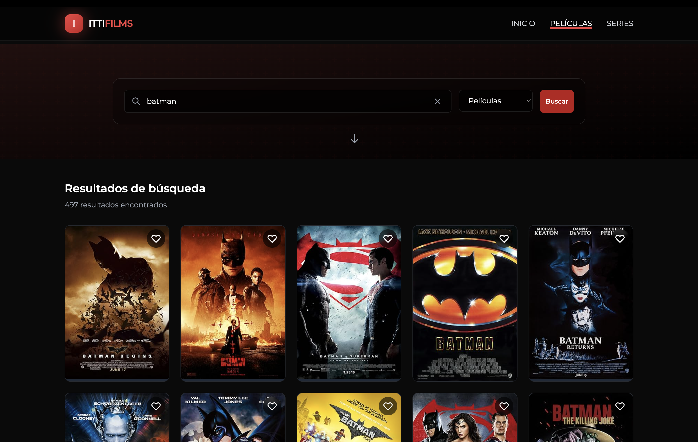
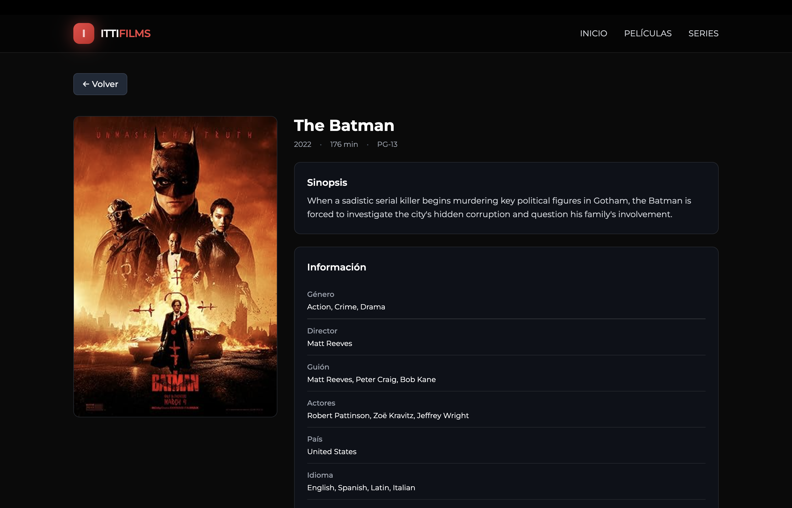
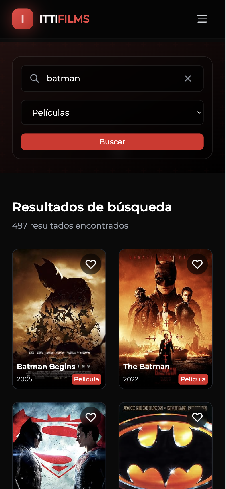

# ITTIFILMS - Movie & Series Search App

Una aplicación web moderna para buscar películas y series utilizando la API de OMDB. Desarrollada con React, TypeScript y Tailwind CSS.


## ✍️ Características

- 🔍 **Búsqueda en tiempo real**: Busca películas y series por título
- 🎦 **Filtrado por tipo**: Filtra resultados por películas, series o todos
- 📄 **Paginación**: Navegación fluida entre páginas de resultados
- 🎯 **Vista detallada**: Información completa de cada película/serie
- ❤️ **Favoritos**: Guarda tus películas y series favoritas (localStorage)
- 📱 **Diseño responsivo**: Optimizado para móvil, tablet y desktop
- ✨ **Animaciones**: Transiciones suaves con Framer Motion
- 🎨 **UI moderna**: Interfaz oscura con efectos glassmorphism

## 🚀 Tecnologías

- React 19 + TypeScript
- Vite
- Tailwind CSS
- React Router
- Zustand
- React Query
- Jest + React Testing Library
- Axios

## 📋 Prerrequisitos

- Node.js (v18+)
- npm o yarn
- API Key de OMDB (obtener en https://www.omdbapi.com/apikey.aspx)

## 🛠️ Instalación

1. **Clonar el repositorio:**
```bash
git clone https://github.com/tu-usuario/itti-omdb-app.git
cd itti-omdb-app
```

2. **Instalar dependencias:**
```bash
npm install
# o
yarn install
```

3. **Configurar variables de entorno:**

Crea un archivo `.env` en la raíz del proyecto:
```bash
cp .env.example .env
```

4. **Editar `.env` y agregar tu API Key de OMDB:**
```env
VITE_OMDB_API_KEY=
VITE_OMDB_API_URL=http://www.omdbapi.com/
```

## 🏃‍♂️ Ejecutar el proyecto

### Modo desarrollo:
```bash
npm run dev
```

### Build para producción:
```bash
npm run build
```

### Preview del build:
```bash
npm run preview
```

## 🧪 Testing

### Ejecutar tests:
```bash
npm run test
```

### Tests en modo watch:
```bash
npm run test:watch
```

### Coverage:
```bash
npm run test:coverage
```

## 📝 Scripts disponibles

- `npm run dev` - Inicia el servidor de desarrollo
- `npm run build` - Compila el proyecto para producción
- `npm run preview` - Preview del build de producción
- `npm run lint` - Ejecuta ESLint
- `npm run lint:fix` - Corrige problemas de ESLint automáticamente
- `npm run format` - Formatea el código con Prettier
- `npm run test` - Ejecuta los tests
- `npm run test:watch` - Ejecuta tests en modo watch
- `npm run test:coverage` - Genera reporte de coverage

## 📸 Capturas de Pantalla

### Página de Búsqueda


### Resultados de Búsqueda


### Vista de Detalle


### Vista Móvil


## 🏛️ Arquitectura del Proyecto

```
src/
├── components/          # Componentes React organizados por Atomic Design
│   ├── atoms/          # Componentes básicos (Button, Input, etc.)
│   ├── molecules/      # Componentes compuestos (SearchForm, MovieCard)
│   ├── organisms/      # Componentes complejos (MovieList, Header)
│   ├── pages/          # Páginas de la aplicación
│   └── templates/      # Layouts y templates
├── hooks/              # Custom hooks
├── services/           # Servicios y llamadas a API
├── store/              # Estado global con Zustand
├── types/              # Tipos de TypeScript
├── utils/              # Funciones utilitarias
└── router/             # Configuración de rutas
```

## 🎯 Decisiones de Diseño

### Atomic Design
Se implementó Atomic Design para crear una arquitectura de componentes escalable y mantenible:
- **Atoms**: Componentes básicos reutilizables
- **Molecules**: Combinaciones simples de átomos
- **Organisms**: Componentes complejos con lógica de negocio
- **Pages**: Vistas completas de la aplicación

### Estado Global
Se eligió Zustand por su simplicidad y rendimiento, evitando el boilerplate de Redux mientras se mantiene la predictibilidad del estado.

### React Query
Para el manejo de estado del servidor, proporcionando:
- Cache automático
- Sincronización en segundo plano
- Gestión de estados de carga y error

## 🚀 Mejoras Futuras

### Arquitectura para Proyectos Grandes

En un proyecto de mayor escala, sería ideal implementar:

1. **Domain-Driven Design (DDD)**
   - Separar la lógica de negocio en dominios específicos
   - Implementar casos de uso independientes de la UI
   - Crear entidades y value objects para el dominio

2. **Clean Architecture**
   ```
   src/
   ├── domain/           # Entidades y lógica de negocio
   ├── application/      # Casos de uso
   ├── infrastructure/   # Implementaciones externas
   └── presentation/     # UI (React)
   ```

3. **Mejoras Técnicas**
   - Implementar SSR con Next.js para mejor SEO
   - Agregar internacionalización (i18n)
   - Agregar virtualización para listas largas
   - Implementar lazy loading de imágenes más avanzado

4. **Testing**
   - Aumentar cobertura de tests unitarios
   - Agregar tests de integración
   - Implementar tests E2E con Cypress o Playwright

6. **Características Adicionales**
   - Sistema de autenticación
   - Listas personalizadas de películas
   - Compartir favoritos
   - Recomendaciones basadas en historial
   - Integración con más APIs (trailers, reseñas)

## 🎨 Diseño

- Tailwind CSS para estilos
- Diseño responsive
- Atomic Design para organización de componentes
- Accesibilidad (a11y)
- Framer Motion para animaciones

## 👨‍💻 Autor

**Francisco Ferraro**
- GitHub: [@franciscoferraro](https://github.com/franciscoferraro)

---


